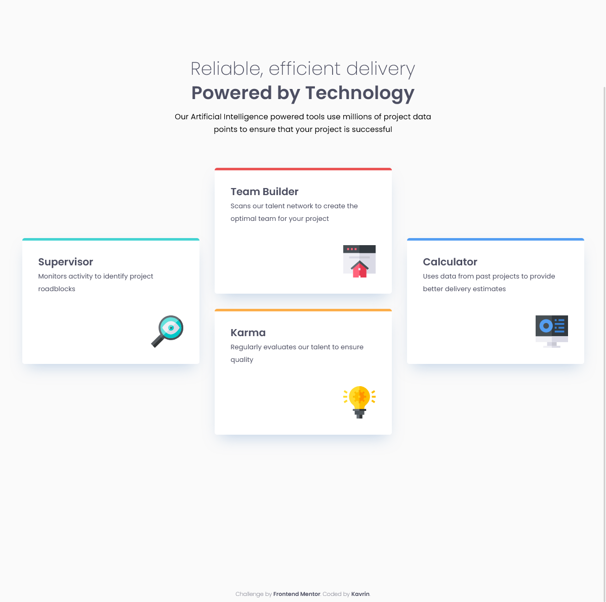

# Frontend Mentor - Four card feature section solution

This is a solution to the [Four card feature section challenge on Frontend Mentor](https://www.frontendmentor.io/challenges/four-card-feature-section-weK1eFYK). Frontend Mentor challenges help you improve your coding skills by building realistic projects.

## Table of contents

-   [Overview](#overview)
    -   [The challenge](#the-challenge)
    -   [Screenshot](#screenshot)
    -   [Links](#links)
-   [My process](#my-process)
    -   [Built with](#built-with)
    -   [Useful resources](#useful-resources)

## Overview

### The challenge

Users should be able to:

-   View the optimal layout for the site depending on their device's screen size

### Screenshot

### Links

-   [Solution](https://github.com/KavrinDEV/four-card-feature-section)
-   [Live Site](https://kavrindev.github.io/four-card-feature-section/)
-   [Animation Branch Live Site](https://fourcardanimation.netlify.app/)

## My process

### Built with

-   Semantic HTML5 markup
-   Flexbox
-   CSS Grid
-   BEM naming convention

### Useful resources

[What is Margin Collapse in CSS? And How to Avoid It](https://www.freecodecamp.org/news/what-is-margin-collapse-and-how-to-avoid-it/)

[CSS Sprites: What They Are, Why They’re Cool, and How To Use Them](https://css-tricks.com/css-sprites/)
